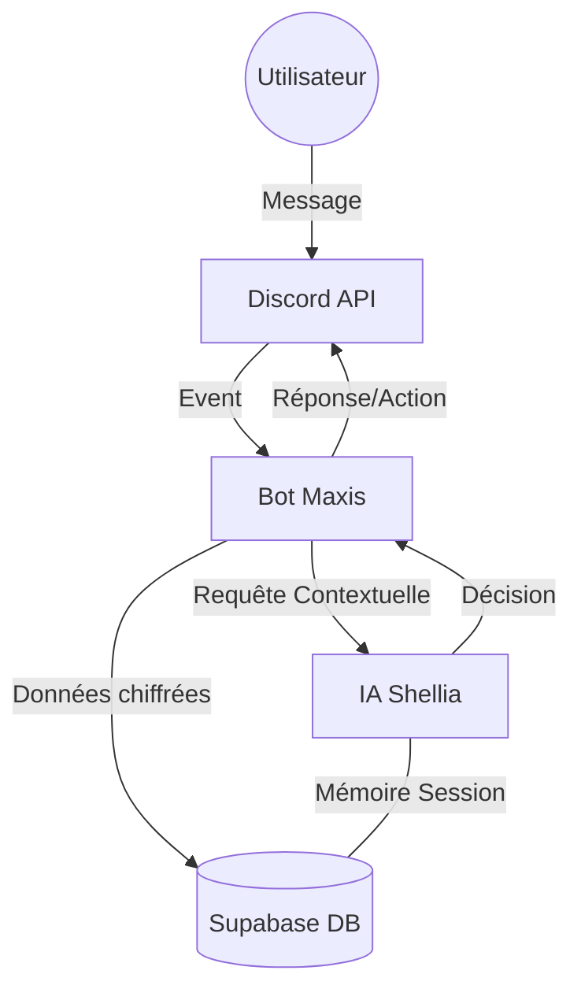

# 🤖 Shellia AI - L'Écosystème Discord Intelligent v2.1

Shellia AI est une infrastructure Discord révolutionnaire qui combine l'intelligence artificielle de pointe avec une automatisation business complète. Ce projet est conçu pour gérer, monétiser et faire croître des communautés Discord de manière totalement autonome.

---

## 🧠 La Logique Centrale : Shellia & Maxis

L'architecture repose sur une séparation claire entre l'**Intelligence** et l'**Exécution**.

### 1. Shellia (Le Cerveau)

Shellia est le contrôleur IA (basé sur Google Gemini). Elle prend les décisions stratégiques, analyse les messages, gère la mémoire des conversations et définit les actions à entreprendre. C'est elle qui communique avec l'utilisateur de manière fluide et intelligente.

### 2. Maxis (Le Corps)

Maxis est l'interface technique (le bot Discord). Il s'occupe de l'exécution : création de channels, gestion des rôles, traitement des paiements Stripe, lancement des giveaways et interaction physique avec l'API Discord. Maxis agit sous les ordres de Shellia.

---

## 🔐 Isolation & Confidentialité (Privacy by Design)

Une des forces majeures de Shellia est sa gestion rigoureuse de l'isolation des données.

### Sessions Utilisateurs Uniques

Chaque utilisateur est traité dans sa propre **Session IA**.

- **Jean** peut donner des clés API Shopify ou des informations sensibles dans son channel privé.
- **Pierre**, même s'il est sur le même serveur, n'aura **aucun accès** aux données de Jean.
- Shellia utilise l'ID unique de l'utilisateur pour séparer strictement les contextes de conversation et les données stockées en base de données (Supabase).

### Canaux Personnels (Tipping Point)

L'accès aux espaces de travail dépend du plan de l'utilisateur :

- **Plans Payants (Basic, Pro, Ultra, Founder)** : Shellia crée automatiquement des channels privés (Ex: `🚀│bureau-jean`) où seul l'utilisateur et le staff peuvent accéder.
- **Plan Gratuit (Free)** : L'utilisateur interagit dans les channels publics (`🤖│chat-ia`) sans espace personnel dédié.

---

## 📈 Onboarding & Parcours Utilisateur

Shellia gère l'arrivée de chaque membre de A à Z :

1.  **Accueil Automatisé** : Dès qu'un membre rejoint, Shellia lui envoie un message de bienvenue personnalisé par DM.
2.  **Attribution de Rôle** : Maxis assigne le rôle `Membre` par défaut.
3.  **Vérification & Trial** : L'utilisateur peut utiliser `/trial` pour tester les fonctionnalités `Pro` pendant 3 jours.
4.  **Évolutivité** : Selon le paiement détecté par Stripe, Maxis met à jour le plan et débloque les accès VIP ou les bureaux personnels en temps réel.

---

## 🛠️ Architecture Technique

---

## 🌟 Fonctionnalités Clés par Plan

| Fonctionnalité          |  Free  | Basic  |  Pro/Ultra  |
| :---------------------- | :----: | :----: | :---------: |
| **Conversations IA**    |   ✅   |   ✅   | ✅ (Avancé) |
| **Quota Quotidien**     | 10 msg | 50 msg | 150-400 msg |
| **Channel Privé**       |   ❌   |   ❌   |     ✅      |
| **Génération Images**   |   ❌   |   ❌   |     ✅      |
| **Support Prioritaire** |   ❌   |   ✅   |  ✅ (VIP)   |
| **OpenClaw Auto**       |   ❌   |   ❌   |     ✅      |

---

## 🎨 Conception Visuelle & Expérience

Le projet inclut un **Dashboard Admin** moderne utilisant le design _Glassmorphism_ pour surveiller :

- Les revenus en temps réel (Stripe).
- La santé de la communauté.
- Les logs de sécurité (Audit Trail).
- Les performances de l'IA.

---

## 🚀 Prêt pour la Production

Ce système est conçu pour être scalable, sécurisé (score 9.3/10) et facile à déployer via Docker. Pour les instructions détaillées, consultez le [Guide de Déploiement](<file:///c:/Users/Mick/Downloads/Kimi_Agent_Discord%20Channel%20Setup%20&%20API%20(1)/shellia-project/SHELLIA_GUIDE.md>).

---

**Version** : 2.1-PLUS  
**Propulsé par** : Shellia Intelligence & Maxis Execution
